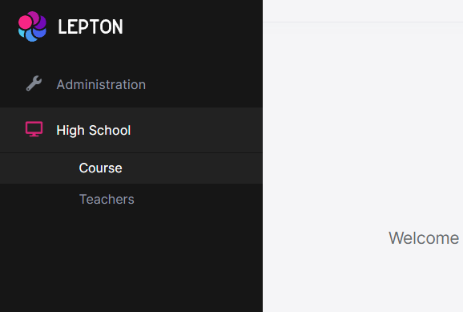
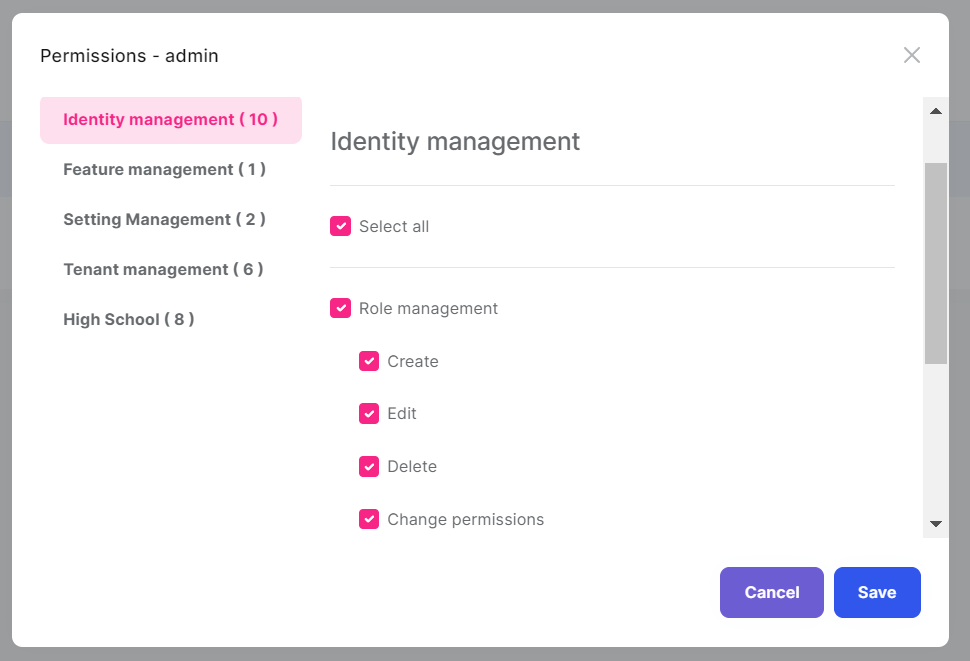

# HighSchool
>   Web Application Development Tutorial <a href="https://docs.abp.io/en/abp/latest/Tutorials/Part-1?UI=BlazorServer&DB=EF" >abp.io </a>

## Website

#### Menu
> 

#### Permissions
> 

#### Course
> 

###### Course Create
> 

###### Course Edit
> 

#### Teacher
> 

###### Teacher Create
> 

## Website Login
##### Admin 
> * Username: admin
> * Password: 1q2w3E*
